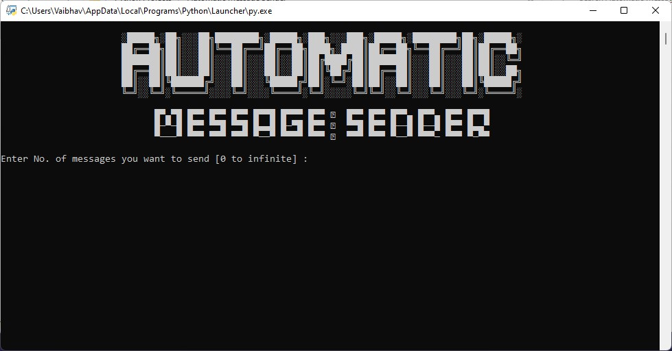
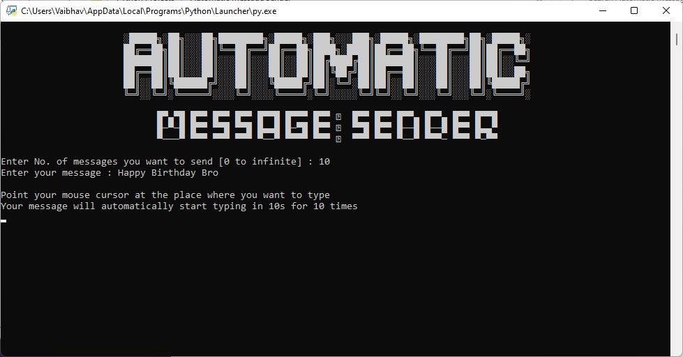
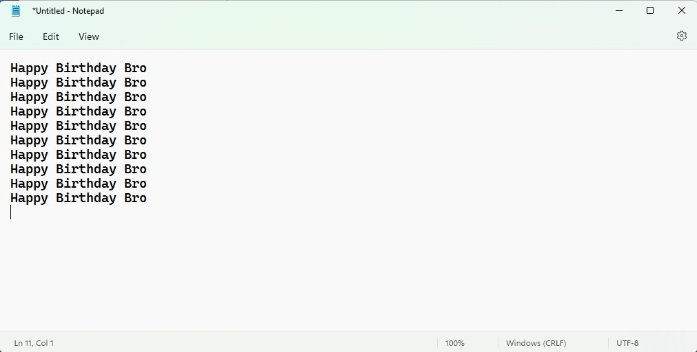

<div  align="center" >
  
</div>

# About
A simple script which automatically types your message unlimited times

# Prerequisites

 Pyautogui
 ```
  pip install PyAutoGUI
 ```
 
 # Installation And Usage
 1. Download the code
 2. Run the main.py file by clicking only
 3. And follow the code instructions
 4. That's it!!

# Screenshot



